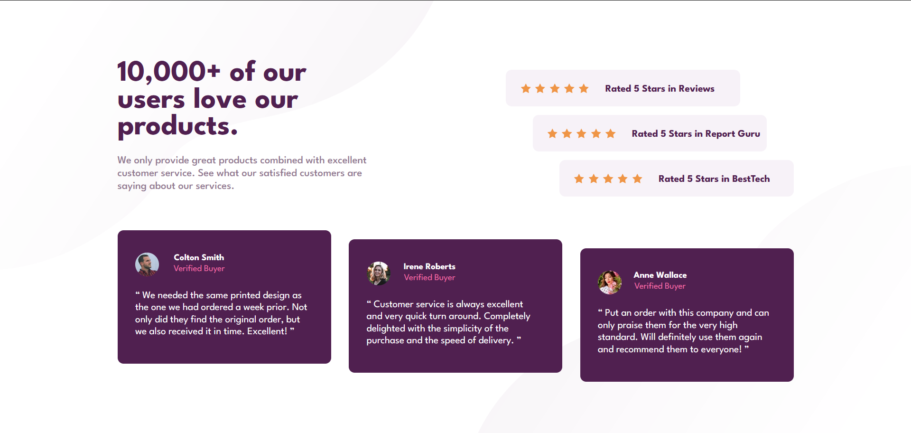
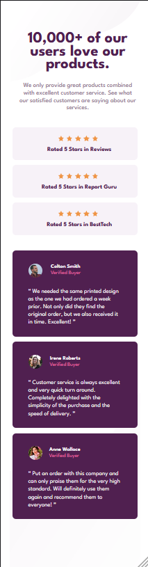

# Frontend Mentor - Social proof section solution

This is a solution to the [Social proof section challenge on Frontend Mentor](https://www.frontendmentor.io/challenges/social-proof-section-6e0qTv_bA). Frontend Mentor challenges help you improve your coding skills by building realistic projects. 

## Table of contents

- [Overview](#overview)
  - [The challenge](#the-challenge)
  - [Screenshot](#screenshot)
  - [Links](#links)
  - [Built with](#built-with)
  - [What I learned](#what-i-learned)
  - [Author](#author)

## Overview

First time copying a front end project. This was a simple but still time consuming project made with HTML5 and CSS3 in the year 2024.

### The challenge

Users should be able to:

- View the optimal layout for the section depending on their device's screen size.

### Screenshots

### Link

- Solution URL: [Add solution URL here](https://your-solution-url.com)

### Built with

- Semantic HTML5 markup
- CSS custom properties
- Flexbox

### What I learned

I learned how to overcome a CSS challenge through determination by making sure to sit and get through it until the end. This required having to find out which areas/classes needed what specific styles. I troubleshooted multiple divs to make sure I got the right styles applied as well as using time to conduct my own online research in certian areas to improve my own overall knowledge.  

Through this challenge and my own frustrations, I was able to learn what all the multiple ways of centering an object were. I already was aware of the techniques before, but not on when to exactly use them. I am proud to say I will be able to refer back to this project in the future instead of confusing myself!

## Author

- Website - [Jack](https://www.your-site.com)
- Frontend Mentor - [@JxckWilsxn](https://www.frontendmentor.io/profile/JxckWilsxn)
